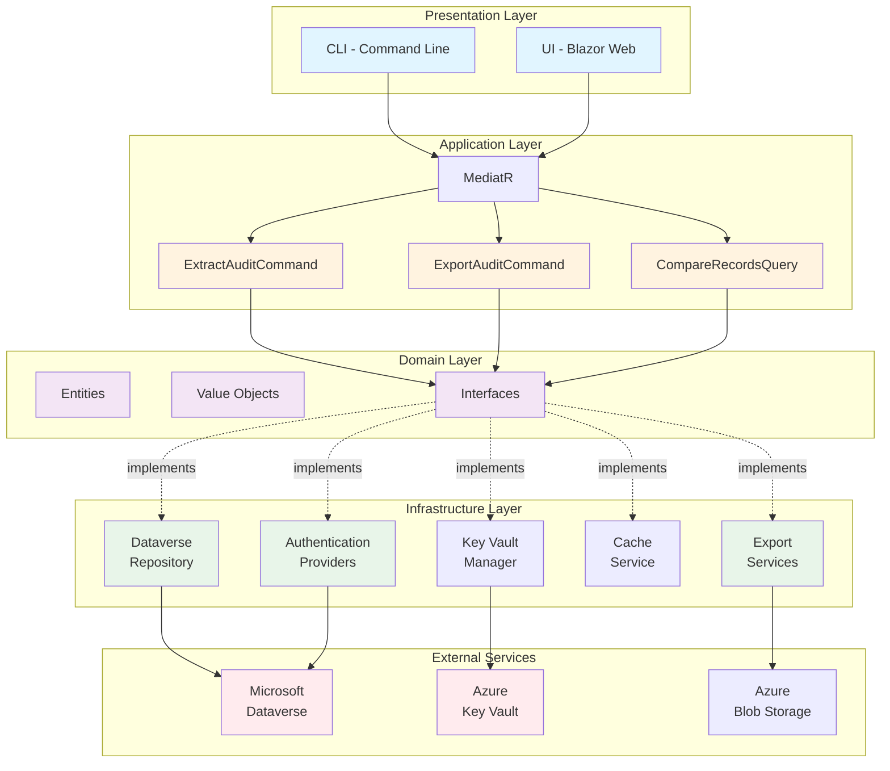
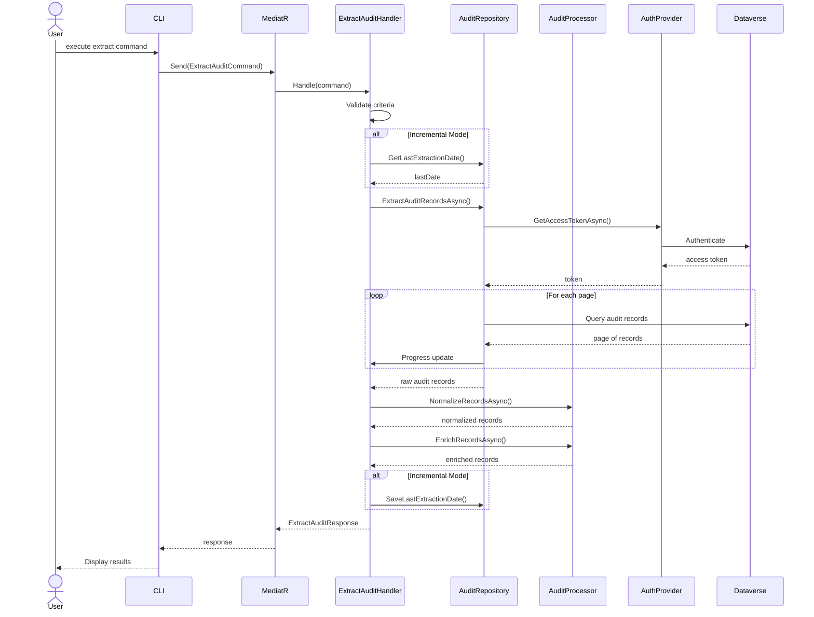
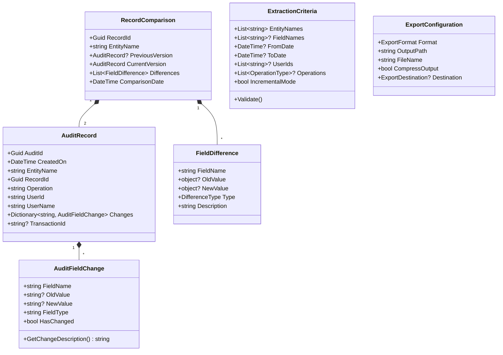
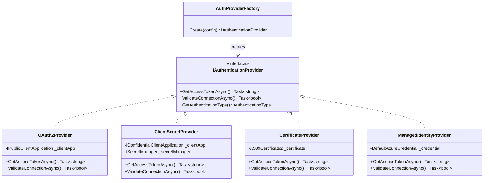
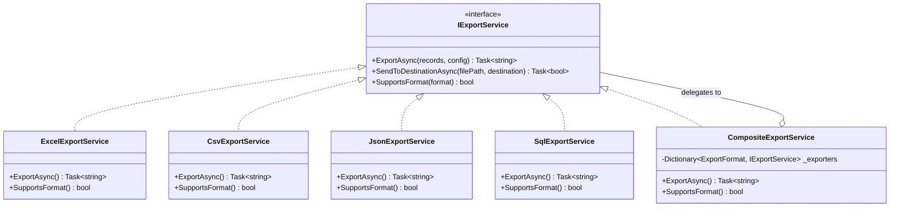
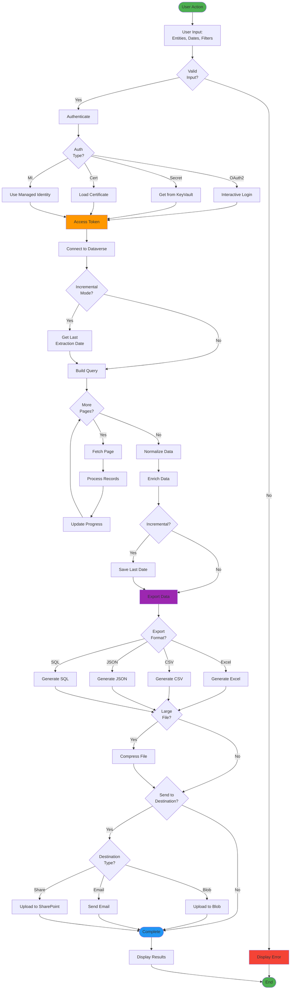
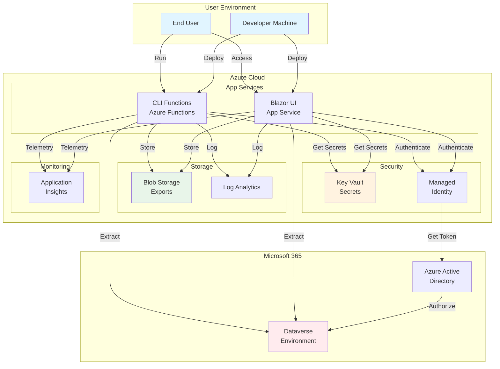
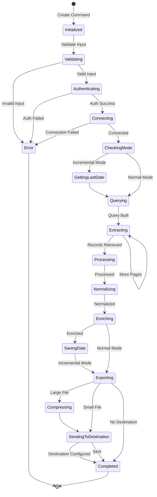
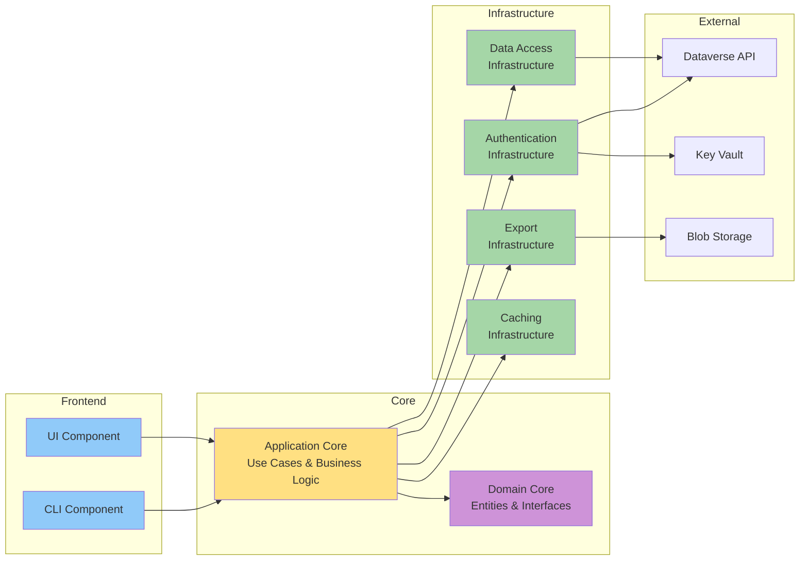

# Diagramas de Arquitectura - Audit History Extractor Pro

## Diagrama de Arquitectura de Capas

## Flujo de Extracción de Auditoría

## Diagrama de Clases del Dominio

## Patrón Strategy para Autenticación

## Patrón Composite para Exportación

## Flujo de Datos Completo

## Arquitectura de Despliegue

## Modelo de Estados de Extracción

## Diagrama de Componentes

---

**Nota:** Estos diagramas pueden ser visualizados usando herramientas que soporten Mermaid, como:
- GitHub (visualización automática)
- VS Code con extensión Mermaid
- draw.io con plugin Mermaid
- Sitio web mermaid.live
